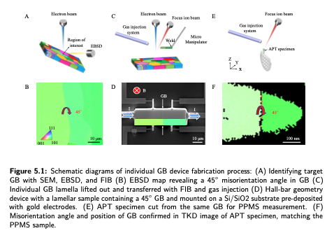
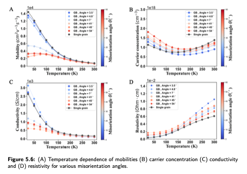

# Quantum Design Dynacool and PPMS Data Analysis

This script is used to analyze the data collected by Quantum Design Dynacool and PPMS for temperature-dependent conductivity and Hall measurement. The device employs hall bar geometry and connects through Bridge 1 for temperature-dependent conductivity measurement and Bridge 2 or 3 for Hall measurement, configured via the PPMS measurement software and a specific break-out box.

The measurement process is divided into two parts:

1. **Resistivity Cooldown Measurement**: This part involves measuring the longitudinal resistivities (xx-direction) as the temperature cools down from 300K to 2K.

2. **Hall Measurement**: Hall measurements are taken under magnetic fields ranging from -1 T to 1 T or -9 T to 9 T at different temperature levels (2K, 5K, 10K, 25K, 50K, 75K, 100K, 125K, ..., 300K). The magnetic resistance at each temperature level during the magnetic field scanning is recorded, and physical parameters such as carrier concentration and mobility are calculated. These calculated transport properties are visualized in the figure below.

## Usage

Due to the implementation of the argparse library, only the data file path and saved path of the target calculated CSV file and plotted figures need to change.
To analyze and plot the temperature  in Redshift, run:

To get the transport parameter at each temperature, execute: 

To combine the transport properties of the device at different temperature levels, run: 

The code is applicable to analyze the transport at individual grain boundaries in the Nature Communication paper: 
[Wu, Riga, et al. "Strong charge carrier scattering at grain boundaries of PbTe caused by the collapse of metavalent bonding." Nature Communications 14.1 (2023): 719.]([https://example.com/paper-doe-smith](https://www.ncbi.nlm.nih.gov/pmc/articles/PMC9911745/pdf/41467_2023_Article_36415.pdf)https://www.ncbi.nlm.nih.gov/pmc/articles/PMC9911745/pdf/41467_2023_Article_36415.pdf) - *Strong charge carrier scattering at grain
boundaries of PbTe caused by the collapse
of metavalent bonding*
